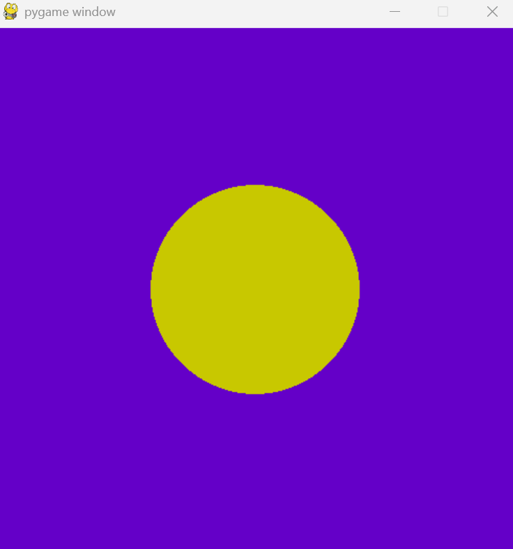

These 3 codes are just some practice i did because i was interested in pygame.

PROG1.PY:
This is a simple code which prints a circle on the screen. i played around with colors, positions and screen sizes.

COLORBOX.PY:
This is a code in which i tried to print all colors on my screen using loops. my loop logic was weird so i ended up getting a strange yet cool pattern. rather than considering it as a fail, i kept it.

COLORBOX2.PY:
This is the one which gave the desired output which is a rainbow square. simple yet pretty. it took a while to understand the logic and values, and it was satusfying when i finally understood.

looking forward to learning more.
